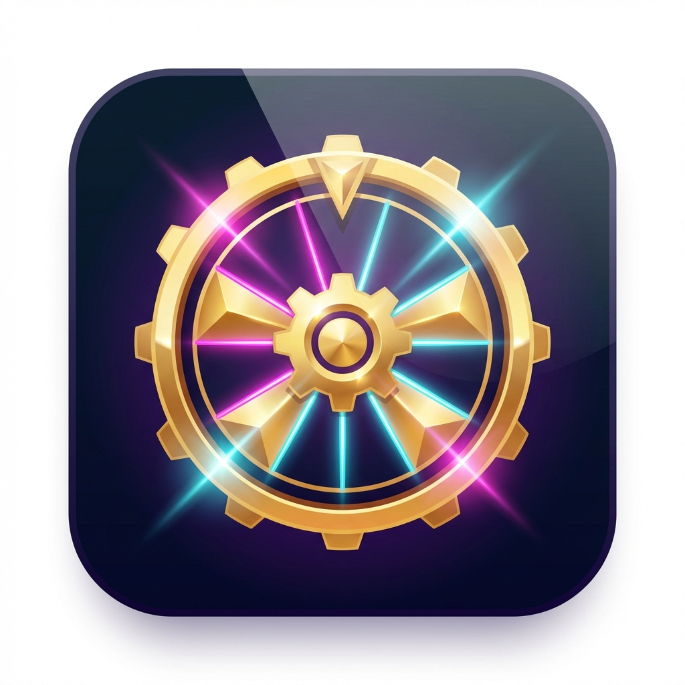

# 🥓 Get Your Salami


<div align="center">
  
  <h1>✨ Spin. Win. Celebrate. ✨</h1>
  <p><i>A premium, high-thrill spinning wheel application built with Flutter. Experiece neon glows, 3D animations, and immersive audio.</i></p>
</div>

---

## 🎨 Features that WOW

### 🎢 **High-Stakes Thrill**
*   **12-Second Suspense Spin**: Each spin is a journey. Will you hit the jackpot?
*   **Physics-Based Animation**: Smooth `CurvedAnimation` with ease-out physics.
*   **Haptic Feedback**: Feel every tick and stop with integrated vibration.

### 💎 **Glassmorphism UI**
*   **Frosted Glass Elements**: Modern, translucent UI components with `BackdropFilter`.
*   **Dynamic Backgrounds**: Animated glowing orbs that breathe and move.
*   **Neon Aesthetics**: Rich gradients and deep colors for a premium look.

### 🔊 **Immersive Audio**
*   **3D Sound Mixing**: Separate audio channels for BGM, Ticks, Whooshes, and Wins.
*   **Smart Audio Engine**: Non-blocking audio playback using `lowLatency` mode.
*   **User Control**: Granular settings to toggle Music and SFX independently.

---

## 📸 visual showcase

| **Premium Splash** | **Neon Wheel** | **Glass Settings** |
|:---:|:---:|:---:|
| <div style="background: linear-gradient(45deg, #E8F5E9, #A5D6A7); padding: 20px; border-radius: 10px;"><b>🍃 Fresh & clean<br>3D Loading Bar</b></div> | <div style="background: linear-gradient(45deg, #1A237E, #FF00CC); padding: 20px; border-radius: 10px;"><b>🎡 Glowing Wheel<br>Pulsing Animation</b></div> | <div style="background: linear-gradient(45deg, #000000, #434343); padding: 20px; border-radius: 10px;"><b>⚙️ Frosted Glass<br>Blur Effects</b></div> |

*(Add your screenshots here)*

---

## 🛠️ Tech Stack

*   **Framework**: Flutter 3.x
*   **Language**: Dart
*   **State Management**: `setState` (Clean & Performant for this scale)
*   **Animations**: `flutter_animate`, `curved_animation`
*   **Audio**: `audioplayers` (with multi-context support)
*   **Storage**: `shared_preferences` (for settings persistence)

---

## 🚀 Installation

1.  **Clone the Repo**
    ```bash
    git clone https://github.com/Shovon021/Get-Your-Salami.git
    cd Get-Your-Salami
    ```

2.  **Install Dependencies**
    ```bash
    flutter pub get
    ```

3.  **Run the App**
    ```bash
    flutter run
    ```

4.  **Build Release APK**
    ```bash
    flutter build apk --release
    ```

---

## 👨‍💻 Developed By

<div align="center">
  <h3><b>Adnan Al Mim</b></h3>
  <p><i>Flutter Developer & UI/UX Enthusiast</i></p>
</div>

---

<div align="center">
  
  <br>
  <sub>Built with ❤️ in Flutter</sub>
</div>
